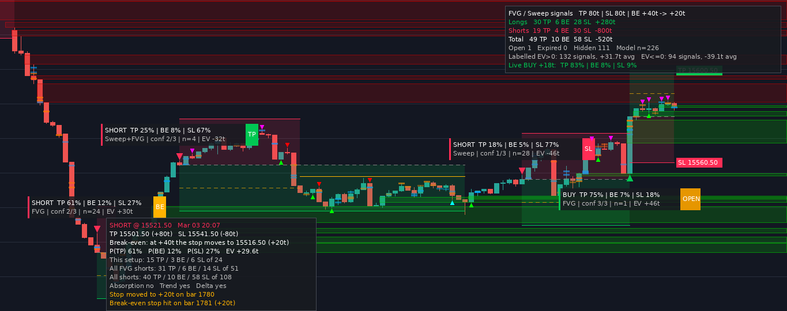

# FVG Reaction + Liquidity Sweep — ATAS indicator

A custom indicator for the [ATAS](https://atas.net) platform that:

1. **reads candlestick patterns**: the ones on [TraderLion's cheat sheet](https://traderlion.com/technical-analysis/candlestick-patterns-cheat-sheet/)
   plus ten stronger, confirmed ones;
2. uses those patterns to tell whether price reacted **bullish or bearish off a Fair Value Gap**;
3. finds **the price inside each bar where the most contracts were filled** (big compared with
   recent bars, so the size follows the market), marks whether the resting bids or offers were
   filled there, and reads the reaction that followed (bullish or bearish);
4. shows the **resting limit orders of 70+ contracts still waiting in the order book**, live
   from Level 2, and tells filled orders from pulled ones;
5. **stops watching a gap once it has been used or filled**;
6. marks the **key levels** where stops pile up: the prior day's, the overnight and the opening
   range's high and low, and equal highs / lows. It shows which ones price swept and which it broke;
7. turns reactions and liquidity sweeps into **BUY / SHORT signals with the odds of each way the
   trade can end**: the take profit (80 ticks), the break-even stop (the stop moves to +20 ticks
   once the trade is 40 ticks in profit) or the stop loss (80 ticks). By default they only fire
   during regular hours, 09:30–16:00 New York time. The bracket can instead follow the market (a
   multiple of the ATR, or the stop just beyond the signal bar), and the entry can be a limit order
   on a pullback;
8. keeps a **scoreboard** of how each setup and each candlestick pattern has done on your chart,
   and checks whether the odds it showed held up.



*Layout preview produced by the test harness from synthetic data (a 1-minute chart in regular
hours), with a simulated order book and the mouse over the overnight low's tag. It is not an ATAS
screenshot: ATAS draws the candles and arrows itself, with its own fonts and theme.*

## What it draws

| On the chart | Meaning |
|---|---|
| Teal / red boxes reaching the right edge | Bullish / bearish Fair Value Gaps still being watched, with a dashed line at their middle (50%) |
| Small ▲ / ▼ | A bullish / bearish reaction off a gap that did not become a signal on the chart. Hover it for the pattern (or switch on *Show reaction labels* to name it, e.g. `Hammer`) |
| Bubbles | Big fills: the price inside a bar where the most contracts traded (live, also a big resting order the order book saw filled). Bigger = more contracts. **Green** = the reaction after it was bullish, **red** = bearish, **gray** = no clear reaction; faint while it is still being watched |
| White ring around a bubble | The order book saw a resting order of 70+ contracts filled right there |
| Blue / orange bands with a size tag | Resting **bids / offers of 70+ contracts** still waiting in the order book, from the bar where they appeared; the tag at the right edge shows their size. The bigger the order, the stronger the color. A filled one stops, faintly, where it was filled |
| Dotted line ending in a dot | A liquidity sweep: from the swing high / low that held the stops to the bar that ran them |
| Lavender lines labelled `PDH`, `ONL`, `ORH`, `EQL`... | Key levels: prior day, overnight and opening range highs / lows, equal highs / lows. Bright while untouched. Where a bar swept one, the line stops, dimmer, with a dot (red for highs, green for lows). Faint and dashed where a bar closed beyond it |
| **Large arrows + card** | **BUY / SHORT signal** of the open trade: the setup, the odds of TP / break-even / SL and the expected ticks |
| Large arrows + small chip | A signal whose trade has ended, with its result: `TP +80t`, `BE +20t`, `SL -80t` or `EXP` |
| Shaded boxes | The open trade: entry → TP shaded green, entry → SL shaded red, amber dotted line at the break-even trigger (+40 ticks), solid amber once the stop has moved to +20, price tags at the right end. Trades that have ended leave a faint box |
| Panel | Results, the labels' track record, the signal hours, the fills and resting orders so far with the size each needs now, and the live odds of the open trade. Hover it for the scoreboard |

Hover the mouse over a card or chip, a bubble, a reaction marker, an order band or a key level's
label for the details.
Gaps that are no longer watched can also be kept as faint boxes (*Show used / filled zones*).

## Fair Value Gaps

A gap is the classic three-candle imbalance: a **bullish** gap when the third candle's low is
above the first candle's high, a **bearish** one when the third candle's high is below the first
candle's low, by at least *Min FVG Size* ticks (4). *Min FVG size (× ATR)* can also ask for a
share of the average true range of the bars before the gap, so small gaps in a busy market don't
count (off by default).

A gap is watched from the candle after the one that completes it, until one of these happens,
and then it is never used again:

* **Used**: a reaction formed at it (below). The first reaction uses it.
* **Filled**: by default when price reaches its far edge (a bullish gap's bottom, a bearish
  gap's top). *FVG is filled when* can instead wait for a candle to close beyond it, or
  count the gap as filled once price reaches its middle (50%). When a reaction and a fill come
  on the same bar (a candle that stabs through the whole gap and closes back out of it with a
  pattern), the reaction counts first.
* **Expired**: nothing used or filled it within *Zone Max Age* bars (150).

Gaps that stop being watched disappear from the chart. Switch *Show used / filled zones* on to
keep a faint box for each, up to the bar where it ended.

### Bullish or bearish reaction?

A reaction is a **candlestick pattern that formed at the gap**: it completes on a closed bar and
one of its candles traded into the gap. A three-candle pattern counts when its first candle
touched the gap, for example. The pattern decides which way the reaction goes:

* a **bullish** pattern (hammer, engulfing, morning star...) is a bullish reaction, a **bearish**
  pattern is a bearish one, at either kind of gap. A bullish gap that holds gives a bullish
  reaction; a bearish pattern at a bullish gap means it failed.
* with *Require reaction close beyond zone* on (the default), a bullish reaction has to close
  above the gap and a bearish one below it, not just form a pattern inside it.
* price comes **down** into a bullish gap and **up** into a bearish one. That is the "after a
  decline / after a rally" the cheat sheet reads the hammer shapes by, so a long lower wick is a
  hammer at a bullish gap and a hanging man at a bearish one (see below).
* if a bar completes both a bullish and a bearish pattern, the stronger one (table below)
  decides. When they are equally strong it is no reaction yet, and the gap is still watched.
* the candle that completes a gap never counts as its retest: it sits right on the gap's edge.

## Candlestick patterns

All the patterns of the cheat sheet are kept. Ten new ones are added (marked **new**): the
*confirmed* versions of the cheat sheet's two-candle patterns (a harami or an engulfing that
the next candle confirms), the doji star, the outside reversal bar (it suits futures, which
rarely gap, and FVG retests, where price stabs into the gap and snaps back) and the four-candle
three-line strike.

Strongest first. The order decides which pattern a label names first and which one wins when
a bar shows patterns both ways. It runs from the patterns that show a complete, confirmed turn
to the single candles, with the ones usually read as needing confirmation last.

| Bullish | Bearish | Candles | Rule |
|---|---|---|---|
| Bullish three-line strike **new** | Bearish three-line strike **new** | 4 | three bearish candles, each closing lower, then a bullish candle that opens at or below the last close and closes above the first one's open, wiping all three out |
| Morning doji star **new** | Evening doji star **new** | 3 | a morning (evening) star whose star is a doji |
| Morning star | Evening star | 3 | a long bearish candle, a small star whose body stays below the middle of the first body, then a long bullish candle closing above that middle |
| Three outside up **new** | Three outside down **new** | 3 | a bullish engulfing, then a candle closing higher still |
| Three white soldiers | Three black crows | 3 | three long bullish candles, each opening inside the body before it, closing higher and in the top quarter of its range |
| Bullish outside reversal **new** | Bearish outside reversal **new** | 2 | trades below the previous low and above the previous high, and closes above the previous high: a bullish candle (bearish: closes below the previous low) |
| Bullish engulfing | Bearish engulfing | 2 | a bearish candle, then a bullish one with a bigger body, at least an average one, covering its whole body |
| Three inside up **new** | Three inside down **new** | 3 | a long bearish candle, a small candle whose body stays inside it, then a bullish candle closing above the first one's open |
| Piercing line | Dark cloud cover | 2 | after a long bearish candle, a bullish one that opens at or below its close and closes above the middle of its body, but below its open |
| Hammer | Shooting star | 1 | a lower wick at least 2× the body (*Hammer wick / body*), the upper wick at most a tenth of the range |
| Dragonfly doji | Gravestone doji | 1 | the same, when the body is at most a tenth of the range |
| Tweezer bottom | Tweezer top | 2 | a bearish then a bullish candle with the same low, within *Tweezer match* ticks (tops: bullish then bearish, same high) |
| Bullish marubozu | Bearish marubozu | 1 | a long candle with (almost) no wicks, at most 5% of its range each |
| Bullish harami | Bearish harami | 2 | a long bearish candle, then a small bullish one whose body stays inside it |
| Inverted hammer | Hanging man | 1 | a shooting star's shape after a decline (inverted hammer), a hammer's shape after a rally (hanging man) |

The bearish column is the mirror image of the bullish one. Some sources name the three-line
strikes the other way round, after the trend that comes before them. Here every pattern is named after
the way it points.

* **Long and small bodies** are measured against the average body of the 14 candles before the
  pattern (*Average body*).
* **Context.** The hammer shapes (hammer, shooting star, dragonfly / gravestone doji, inverted
  hammer, hanging man) mean different things depending on where they appear. After a decline
  a long lower wick is a hammer and a long upper wick an inverted hammer, both bullish. After a
  rally they are a hanging man and a shooting star, both bearish. "After a decline" means at a
  bullish gap, at filled bids, or at a swept low. "After a rally" means at a bearish gap, at
  filled offers, or at a swept high. All other patterns point the same way wherever they appear.
* **Futures rarely gap between bars**, so "opens below the previous close" is read as "at or
  below", and a star needs no gap.
* A plain **doji** or **spinning top** is indecision and points neither way, so it doesn't count
  on its own; it shows up as the star of a morning / evening star.
* Each pattern pair has its own switch under *Candlestick Patterns*.

## Big fills and the reaction after them

For every closed bar the indicator reads the footprint. The price where **the most contracts
traded** is a big fill when it stands out twice:

* **against recent bars** (*Big fill size*). By default it has to rank in the top *Top share of
  recent bars* (10%) of the busiest prices of the last *Fill lookback* bars (200). So the size
  follows the instrument, the timeframe and the time of day on its own. It is measured against
  earlier bars only (no look-ahead), and needs 20 bars with a footprint to start. The panel shows
  the size it takes now (`big ≥412`). Set *Big fill size* to *A fixed number of contracts* to use
  *Min filled volume at one price* (150) instead;
* **inside its bar**: at least *Filled volume vs bar average* (3×) the bar's average volume per
  price.

Whoever waited there got filled:

* more volume traded on the **bid** (sellers hit it) → **resting bids were filled**. Price came
  down into them;
* more traded on the **ask** (buyers lifted it) → **resting offers were filled**. Price rallied
  into them.

The **reaction** is the first candlestick pattern, on the fill bar or one of the next
*Reaction window* bars (3), that closes away from the fill price. A bullish pattern closing above
it is a bullish reaction and a bearish pattern closing below it is a bearish one. The hammer
shapes are read by the context above. With no pattern in the window the fill is marked "no clear
reaction" (gray). Hover a bubble to see who was filled, the reaction and how far price went
up and down in the window.

## Resting orders (Level 2)

While the chart is open the indicator follows the order book and the time & sales that ATAS
streams to it. Every price where at least **70 contracts** (*Min resting order*) sit on the bid or
the offer is a resting order. It is drawn as a band on its price from the bar where it
appeared, with its size at the right edge. **These are the big orders that have not been filled
yet.** The panel counts them and names the largest.

*Resting order size* can instead ask for a multiple of what is normal in the book: at least
*Resting order vs typical level* (5×) the median size of the prices in the book when the order
appears (70 while the book shows fewer than 5 prices). Each order keeps the size it was measured
against, so it doesn't come and go as the rest of the book changes.

When such a level drops below its size, the indicator checks the trades printed at its price:

* **Filled**: trades against it (sells into a bid, buys into an offer) took at least *Filled when
  traded* (50%) of its size. The band stops there. If the bar's big fill is at that price, on that
  side, its bubble gets a white ring. If not, the order becomes a big fill of its own (a bubble
  with a ring) once as many contracts traded against it as a big fill needs (the panel's `big ≥`,
  or *Min filled volume*, 150, with a fixed size). Its reaction is read like any other fill.
* **Pulled**: the trades at its price did not reach that share within 2 seconds, so the orders
  were cancelled rather than filled.
* **Left the visible depth**: not filled either, but it was the deepest level in the book when it
  vanished, so it has most likely just scrolled out of the depth the feed sends.

Pulled orders and the ones that left the visible depth are hidden unless *Show pulled orders*
is on.

What Level 2 can and can't do inside an indicator:

* ATAS gives indicators the order book **live**, not the history behind its heatmap. Resting
  orders and order-book fills start from the current book when the chart loads, and build up
  while it stays open. They reset whenever the chart recalculates, for example after a
  settings change.
* The book shows **contracts per price**, not individual orders, so "70 limit orders" is read
  as 70 contracts resting at one price. Set *Min resting order* to 71 for strictly more than 70.
* It only covers the depth your feed sends, often 10 prices each side for CME futures. A big
  order further away is seen once price comes close, and one that price moves away from drops
  out of view.
* Because history has no order book to replay, **signals never use Level 2**. They use candles
  and the footprint, which history has too, so they come out the same after a reload.

## Liquidity sweeps

A sweep is a bar that wicks beyond the high / low of the last *Swing Lookback* bars (10) and closes
back inside: a stop run. A dotted line joins the swing it took to the sweep bar.

Two filters keep only the clearer stop runs. Both are off by default:

* **Min sweep depth** (× ATR): the wick has to reach this many average true ranges beyond the
  high / low. A poke of a tick or two takes few stops. The ATR is the average range of the
  *Volatility (ATR) period* bars (20) before the sweep bar, so the depth follows the market. A
  key level taken by a shallower wick still ends as swept, but gives no signal.
* **Sweep confirmed swings only**: the bar has to take out a swing high / low of the lookback
  (higher / lower than the 3 bars on each side) that nothing has traded beyond since. When it
  takes several, the line goes to the furthest one. A swing counts once: after a bar has traded
  beyond it, it is gone. Without this filter, any bar that wicks beyond the lookback's high / low
  counts, even when that was the last bar's.

## Key levels

Some highs and lows are watched by everyone, so stops pile up just beyond them. The indicator
marks them in New York time, whatever time zone the chart shows (summer time included). Its
trading day starts at 18:00, when CME's overnight session opens.

| Level | Tag | The high and low of | Watched from |
|---|---|---|---|
| Prior day | `PDH` / `PDL` | the previous regular session (*Regular hours start / end*: 09:30–16:00) | the start of the trading day |
| Overnight | `ONH` / `ONL` | 18:00 until regular hours open | the first bar of regular hours |
| Opening range | `ORH` / `ORL` | the first *Opening range* minutes (30) of regular hours | the first bar after the opening range |
| Equal highs / lows | `EQH` / `EQL` | two swing highs (lows) within *Equal level match* ticks (2) of each other, at most *Equal level lookback* bars (120) apart, with no bar trading beyond them in between | the bar after the second swing is confirmed |

A swing high is higher than the 3 bars before it, and none of the 3 after it goes higher, so it
is confirmed 3 bars later (swing lows the other way round). Equal highs are marked at the higher
of the two highs, equal lows at the lower of the two lows.

The first bar that trades beyond a level takes it, and the level is not watched after that:

* **swept**: the bar closes back inside. The stops were run and price came back. The line stops
  there with a dot;
* **broken**: the bar closes beyond it. Price accepted the other side. The line turns faint and
  dashed.

A day's levels that nothing took by the end of the trading day stop there. Equal highs / lows
stop once *Equal level lookback* bars have passed since their second swing. Hover a level's tag to
see what it is, when it started to count and how it ended.

## BUY / SHORT signals

A signal is decided when a bar **closes**, so it never repaints. It needs a trigger (*Signal
source*):

* **FVG**: a reaction off a gap. A bullish reaction gives a BUY, a bearish one a SHORT.
* **Sweep+FVG**: an FVG reaction within *Sweep -> FVG window* bars (10) after a sweep on the same
  side: liquidity is taken, then price reverses out of an imbalance.
* **Key sweep+FVG** (e.g. `PDL sweep+FVG`): the same after a sweep of a key level.
* **Fill**: a reaction to a big footprint fill.
* **Key sweep** (e.g. `Sweep ONH`): a bar that sweeps a key level: lows for a BUY, highs for a
  SHORT. When it sweeps several, the most important one names it: the prior day first, then the
  overnight range, the opening range and equal highs / lows. Between two of a kind, the further
  one wins: it took more stops.
* **Sweep**: a liquidity sweep: of lows for a BUY, of highs for a SHORT.

When a bar has several, the FVG reaction comes first, then the fill reaction, the key sweep and
the plain sweep. A key sweep outranks a plain one, so an FVG reaction after both is a *Key
sweep+FVG*.

Each signal counts up to four confirmations, and any of them can be made mandatory:

* **trend**: the close is above (buys) or below (shorts) the 50 EMA;
* **delta**: the bar's delta points the signal's way;
* **order flow**: a big fill of resting bids in the lower 35% of the signal bar or the bar before
  (buys), or of resting offers in the upper 35% (shorts). The passive side absorbed the
  aggression and price didn't go through;
* **candlestick pattern**: FVG and fill reactions always have one; a sweep counts it when the
  sweep bar completes a pattern pointing its way.

### Entry, take profit and stop loss

By default the entry is the signal bar's close, and TP and SL are *Take profit* / *Stop loss*
ticks away. With the default 80 / 80 on NQ that is 20 points each way ($400 per NQ contract, $40
per MNQ). Once the trade is *Break-even trigger* ticks in profit (40), its stop moves to
*Break-even stop* ticks in profit (+20), so from then on it ends at +80 or +20. Set the trigger
to 0 to trade the plain 80 / 80 bracket.

*Bracket size* can make the bracket follow the market instead:

* **Multiples of the ATR**: the stop is *Stop loss (× ATR)* (3) average true ranges of the
  *Volatility (ATR) period* bars (20) before the signal, and the take profit *Take profit (× ATR)*
  (3). A busy market gets a wider bracket, a quiet one a tighter one.
* **Stop beyond the signal bar**: the stop sits *Stop buffer* ticks (2) beyond the signal bar's low
  (buys) or high (shorts), where the setup is proven wrong, and the take profit is *Take profit
  (× the stop)* (1.5) times as far.

Either way the stop is kept between *Min stop* (16) and *Max stop* (200) ticks, and the take
profit keeps its ratio to it. The break-even step is then a share of the take profit: the stop
moves once the trade is *Break-even trigger (% of TP)* (50%) of the way there, to *Break-even stop
(% of TP)* (25%) in profit. Each card, chip and tooltip shows the trade's own distances.

*Entry* can also be a **limit order on a pullback**: *Pullback* (25%) of the signal bar's range
back from its close (below it for a buy, above it for a short). The order waits *Limit order
valid* bars (3). It fills once price trades a tick through it, at the limit price, and the
bracket then counts from there. A dashed line with an `LMT` price tag marks it while it waits.
An order that doesn't fill is cancelled: its chip says *No fill*, the panel counts it, and it is
left out of the results and the odds. A waiting order counts as the open trade for *One trade at
a time*.

### Signal hours

By default signals only fire during **regular hours**, 09:30–16:00 New York time (*Signal
hours*). A bar counts by the time it opens, in New York time whatever time zone the chart shows.
Gaps, fills, sweeps and key levels are still found around the clock; only the signals wait. Bars
outside the hours give no signals at all, so they don't count in the statistics either. The
other choices:

* **All hours**: signals around the clock, as before;
* **First two hours of regular hours**: 09:30–11:30, usually the busiest stretch;
* **Regular hours, not 11:30 – 13:30**: skips the lunch lull;
* **Custom window**: from *Custom window start* to *Custom window end*, e.g. 09:30–10:30. A
  window that ends before it starts runs over midnight; the same start and end means all day.

The panel shows which one is on, with the New York time of the last bar to check it against.

### Where the probability comes from

Every signal on the chart is followed forward until it ends: at the TP, at the break-even stop
or at the SL. When a new signal fires, its odds are the shares of **earlier, already finished**
signals of the same kind that ended each way. So the numbers on an old signal are exactly what
the indicator would have shown live (no look-ahead).

"The same kind" is layered: same direction → same trigger → then each split that is switched on,
nested in the one before:

* *Odds by time of day* (off): the first 30 minutes of regular hours, the rest of the morning
  (to 11:30 with the default hours), midday (to 14:00), the afternoon, or outside regular hours;
* *Odds by volatility* (off): quiet, normal or busy, from the ATR of the bars before the signal
  against one ten times as long (under 0.8×, over 1.25×);
* *Odds by trend* (off): with the trend EMA or against it;
* *Odds by confirmations* (on): the number of confirmations.

A narrow group with only a few past trades is blended with its broader parent group
(`p = (count + k·p_parent) / (trades + k)` for each ending, *k* = *Probability smoothing*), so
each split you add needs more history before it says anything. The tooltip lists every group
with its counts. The starting point is the odds of a coin-flip market for the trade's own
bracket. For 80 / 80 with the stop moving to +20 at +40 that is **TP 22%, BE 45%, SL 33%**, worth 0
ticks on average (without break-even: 50 / 50). A fresh chart shows those numbers everywhere, and
they only move as real outcomes accumulate. Load more history for more reliable estimates.

**EV** (expected value) combines the three: `TP% × 80 + BE% × 20 − SL% × 80` ticks, with each
trade's own distances. A positive EV means that kind of signal has paid on this chart so far.

### Reading the chart

```
BUY  FVG · Hammer                  [OPEN]   <- side, trigger, candlestick pattern ("+1" = one more), badge
TP 31%  BE 41%  SL 28%   EV +6t             <- odds of each ending (they add up to 100), expected ticks
```

Once the trade ends, the card shrinks to a chip with its result: **TP +80t** (green), **BE +20t**
(amber, stopped at +20), **SL -80t** (red) or **EXP** (expired). Switch *Compact labels for closed
trades* off to keep every card. Hover a card or a chip for the full breakdown:

* the prices and the break-even levels;
* the TP / BE / SL counts behind the estimate, at each level of grouping;
* which confirmations were present, and every pattern the bar completed;
* the gap or the fill it reacted to;
* when the stop moved and how the trade ended.

By default every signal is shown, weak ones included. A card with a negative EV (hover a chip to
see an old one's) tells you that setup has cost ticks so far. Once the panel's track record shows the labels holding up on your
chart, set **Min expected ticks to show** (e.g. 5) to keep only the better setups on screen.
Hidden signals are still followed, so the statistics keep learning from them.

The panel shows:

* TP / BE / SL counts and net ticks for longs, shorts and total (signals shown on the chart);
* open, expired and hidden signals, limit orders that didn't fill (with a limit entry), and how
  many settled trades the model has learned from;
* the signal hours, and the New York time of the last bar;
* **track record**: the average ticks actually made by signals labelled with a positive EV and
  by the rest, so you can see whether the labels have been reliable on this chart;
* the big fills so far, how many had a bullish or bearish reaction and the size a big fill takes
  now; the resting orders in the book now, the size they need and the largest;
* for an open trade, **live odds** from the current price, e.g.
  `Live BUY +44t, stop +20t:  TP 38% · BE 62% · SL 0%`. Each leg (reaching +40 before the stop,
  then TP before the break-even stop) is a random walk with the drift implied by the entry odds.
  While a limit order waits, the line shows its price and the bar it waits until.

### Scoreboard

Hover the panel, or switch on *Keep the scoreboard open*, for a table of how each kind of signal
has done on this chart. It opens under the panel (above it when the panel sits at the bottom).
Every signal that ended at TP, BE or SL counts, hidden ones included; expired ones don't.

```
Scoreboard: 118 closed signals, hidden ones included
Setup          n   TP   BE   SL     avg
FVG           41    9   17   15   -3.4t
Key sweep     23    8    9    6  +14.8t
...
Pattern        n   TP   BE   SL     avg
Hammer        17    5    7    5   +8.2t
...
Odds check (were the TP odds right?)
Said TP 20–30%: hit 24% of 41
...
```

* **Setup**: a row per trigger (FVG, Sweep, Sweep+FVG, Fill, Key sweep, Key sweep+FVG).
* **Pattern**: a row per candlestick pattern (the ten most frequent) and one for *No pattern*. A
  signal whose bar completed several patterns counts in each of their rows.
* Each row: the number of signals, how many ended at TP / BE / SL, and the average ticks per
  signal, green when it made money, red when it lost.
* **Odds check**: the signals grouped by the TP odds their label showed (under 20%, 20–30%, ...,
  60% and more), with how often they really hit the TP. A line like `Said TP 30–40%: hit 35% of
  52` means the odds have been honest on this chart.

Use it to prune: switch off the patterns that keep losing ticks, pick a narrower *Signal source*,
or change the hours. A row with a handful of signals is mostly noise, so wait for a few dozen
before you judge it.

## Tuning

* **Too many bubbles?** Lower *Top share of recent bars* (say to 5%), or raise the multiplier.
  With *A fixed number of contracts*, *Min filled volume at one price* is a plain count whose right
  value depends on the instrument, the timeframe and the session: raise it until only the fills
  that stand out are left.
* **Resting orders.** 70 contracts at one price usually stands out on NQ. On markets with a much deeper
  book, such as ES, most levels hold more than that: raise *Min resting order* there, or set
  *Resting order size* to *Times the typical level in the book*.
* **Too many lines?** Switch off the key levels you don't trade. Equal highs / lows are the most
  frequent; a smaller *Equal level match* or *Equal level lookback* keeps fewer. With *Draw key
  levels* off their sweeps still give signals, without the lines.
* **Gaps piling up in a trend?** Lower *Zone Max Age* or raise *Min FVG Size*. For fewer, cleaner
  reactions switch off the weaker patterns (marubozu, harami, inverted hammer / hanging man),
  or turn on *Require candlestick pattern* to filter the sweeps.
* **Prune with the scoreboard** once its rows hold a few dozen signals each: switch off the
  patterns and setups that keep losing ticks on your chart.
* **Test a change before you trust it**: replay your own history through the backtest runner,
  pick settings on one stretch and judge them on a later one. Check its worst-case row too, since
  a result that exists only with the assumed order inside bars isn't there (see below).

## Backtest: two years of 1-minute NQ

The runner in `tests/Backtest` replays bars through the indicator (see
[tests/README.md](tests/README.md)). It was run on two years of 1-minute bars of Dukascopy's
Nasdaq-100 CFD (bid prices, 22 September 2024 – 24 September 2026, 519 trading days) as a stand-in
for NQ. It is the same index, but not the futures contract, and it has no footprint, so there are
no *Fill* signals and no delta or order-flow confirmations. Costs are 1 tick of commission and 1
tick of slippage per market order: 3 ticks a trade entered at the close.

**The defaults** (regular hours, 80 / 80, break-even +40 → +20):

| | Trades | TP / BE / SL | Gross a trade | Net a trade |
|---|---|---|---|---|
| Settled as the indicator does | 23,679 | 28.8% / 37.9% / 33.2% | +4.1 ticks | +1.1 ticks |
| Worst-case order inside each bar | 24,453 | 16.6% / 48.6% / 34.7% | −4.8 ticks | −7.8 ticks |

The truth lies between the two rows, and for this bracket near the first: on simulated tick paths
(below) the first overstates it by 1–2 ticks a trade and the worst case understates it by about
9. That leaves the defaults around break-even after costs. The "win rate" (TP or break-even,
67%) says little: random entries with this bracket end at TP or break-even about as often.

**The new settings, tested honestly.** Settings were chosen on the first year only (to 22
September 2025) and judged once on the second:

* The first-year search tried about 400 combinations of entries, brackets, filters and odds
  splits. The best was signals only in the first two hours of regular hours, with a 40 / 40
  bracket and break-even at +20 → +10. It made +3.0 ticks a trade after costs in year 1, and
  **+3.4 in year 2, with 13 of 13 months up**.
* It most likely isn't real. On simulated tick paths with no edge at all, bars settle that
  bracket 4–5 ticks a trade better than the path inside them: more than all of its profit. That
  happens in both years, so the second year can't catch it. With the worst-case order it lost
  4.4 and 7.9 ticks a trade. Only tick data can settle it.
* Measured in ways the bar order can't bias, nothing held up:
  * the plain move 5 to 60 minutes after a signal: no reliable edge in year 1, in any hour window
    or with any filter;
  * brackets without break-even: 80 / 80 lost 4.8 and 2.4 ticks a trade after costs;
  * ATR-sized brackets (3 ATRs each way, with break-even): +1.7 and +1.2 ticks a trade, within
    noise.
* Neither the limit entries nor hiding signals with low expected ticks turned the first year
  positive, with or without the new odds splits.

So the defaults are unchanged. The new settings are there to try ideas on your own market and
data. Judge them with the runner's worst-case row next to the result, or on tick data.

## Honest limits

* The probability is a frequency from the history loaded on the chart, not a guarantee. Markets
  change; small samples stay close to the coin-flip odds by design.
* Fills are idealised: entry at the close (or exactly at the limit price), exact TP / SL, no
  slippage or commission. The backtest runner takes costs off.
* On historical bars the path inside a bar is unknown. It matters whenever a bar holds both the
  TP and the SL, or reaches +40 and also trades back to +20.
  * By default the indicator assumes price went from the open to the **nearer extreme first**,
    then to the other one and the close. TradingView's strategy tester makes the same assumption.
  * That is **optimistic whenever the break-even step fits inside a typical bar**. Price that
    reaches the trigger inside a bar often comes back to the moved stop before the close, and
    no order of a bar's high and low shows that. On simulated tick paths with NQ's 1-minute
    volatility (`tests/PathCheck`), bars overstated the default 80 / 80 (break-even +40 → +20) by
    about 1–2 ticks a trade, and a 40 / 40 bracket with break-even at +20 → +10 by 4–5 ticks.
    Brackets without break-even, and ATR-sized ones, came out within about half a tick.
  * *Worst case* assumes the order that hurts the trade. With break-even on, that means any bar
    that reaches +40 from an open below +20 counts as stopped at break-even: about 9 ticks a trade
    too pessimistic for the default bracket, 1–2 for the 40 / 40 one. The truth usually lies
    between the two, and the backtest runner shows both.
  * Live bars follow the trades as they happen, so they don't have this problem. Reloading the
    chart can settle such a trade differently, and the odds on the labels come from history
    settled this way, so with a tight break-even step they lean optimistic too.
* Candlestick patterns are rules of thumb with fixed thresholds (wicks at most a tenth of the
  range, bodies against a 14-bar average...). They describe what the candles did, not what they
  will do.
* The order book is live only and aggregated per price. Iceberg orders that refill, or orders
  pulled a moment before price arrives, look like any other resting or pulled order.
* Signals close together often ride the same move. The cooldown limits that, but *n* can still
  overstate the independent evidence.
* Key levels and signal hours assume CME's session: a trading day that turns at 18:00 New York
  time, with US summer time. For another market, set *Regular hours start / end* to its session
  in New York time, or use *All hours*. The day still turns at 18:00 New York time.
* Sessions are read from each bar's open time, so they work best on minute charts. On 1-hour
  bars the bar that opens at 09:00 still counts as overnight, and there is no 30-minute opening
  range.
* Key levels come from the bars loaded on the chart: the first day has no prior day, and a day
  that starts partway through gets partial ranges.

## Install

### Mac (ATAS X)

On a Mac, ATAS runs as **ATAS X**. You build the indicator once with Microsoft's free .NET
tools, then copy one file into ATAS X.

1. Install **ATAS X** for macOS if you haven't already, in the usual Applications folder.
2. Install the **.NET 10 SDK** from [dotnet.microsoft.com](https://dotnet.microsoft.com/download/dotnet/10.0)
   using the macOS installer: **Arm64** for Apple Silicon (M1–M4), **x64** for an Intel Mac.
   (Apple menu → About This Mac shows which chip you have.)
3. On this repository's GitHub page, click **Code → Download ZIP** and double-click the ZIP to unzip it.
4. Open **Terminal**, type `cd ` (with a space), drag the unzipped folder onto the Terminal
   window, press Return, then run:

   ```
   dotnet build FvgReactionLiquiditySweep.csproj -c Release
   ```

   It finds the ATAS X libraries in `/Applications/ATAS X.app/Contents/MonoBundle`. If ATAS X is
   somewhere else, add `-p:ATAS_BASE="/path/to/ATAS X.app/Contents/MonoBundle"`.
5. Copy the result into ATAS X's indicator folder:

   ```
   mkdir -p ~/Library/Application\ Support/ATAS/Indicators
   cp bin/Release/net10.0/FvgReactionLiquiditySweep.dll ~/Library/Application\ Support/ATAS/Indicators/
   ```

6. ATAS X loads new or updated indicator files automatically. Add **FVG Reaction + Liquidity
   Sweep** to a chart from the *My Indicators* group.

### Windows (classic ATAS Platform)

1. Build the DLL (needs ATAS installed and the [.NET 10 SDK](https://dotnet.microsoft.com/download/dotnet/10.0)):

   ```
   dotnet build FvgReactionLiquiditySweep.csproj -c Release
   ```

   If ATAS is not in `C:\Program Files (x86)\ATAS Platform`, add `-p:ATAS_BASE="D:\path\to\ATAS Platform"`.
   Or drop `FvgReactionLiquiditySweep.cs` into an indicator project you already have.
2. Copy `bin\Release\net10.0-windows\FvgReactionLiquiditySweep.dll` into `%APPDATA%\ATAS\Indicators`
   (or `Documents\ATAS\Indicators`). ATAS builds that still run on .NET 8 need the DLL from
   `bin\Release\net8.0-windows` instead.
3. Restart ATAS and add **FVG Reaction + Liquidity Sweep** from the *My Indicators* group.

According to the ATAS docs, this Windows DLL also loads in ATAS X, since the indicator has no
custom WPF editors. On Windows you can also build a native ATAS X DLL with `-p:AtasX=true`.

**Data.** The big fills and the delta confirmation read footprint data, so they need a feed with
tick data (e.g. Rithmic). The resting orders need the feed's market depth (Level 2), and only
show while the chart is open.

## Settings

| Group | Setting | Default | |
|---|---|---|---|
| Liquidity Sweep | Swing Lookback (bars) | 10 | bars whose high / low a sweep must run |
| | Show sweeps | on | the dotted sweep lines |
| | Min sweep depth (x ATR, 0 = off) | 0 | how far beyond the high / low a sweep has to trade, in ATRs of the bars before it |
| | Sweep confirmed swings only | off | only swing highs / lows (3 bars each side) nothing has traded beyond since; each counts once |
| Fair Value Gap | Min FVG Size (ticks) | 4 | |
| | Min FVG size (x ATR, 0 = off) | 0 | a gap must also be this many ATRs of the bars before it |
| | Zone Max Age (bars) | 150 | a gap nothing used or filled within this many bars stops being watched |
| | Require reaction close beyond zone | on | a bullish reaction must close above the gap, a bearish one below it |
| | FVG is filled when | Price reaches its far edge | or: a candle closes beyond it; price reaches its middle (50%) |
| | Draw FVG Zones, Show zone midline (50%) | on | |
| | Show used / filled zones | off | a faint box for each gap that is no longer watched |
| | Bullish zone color, Bearish zone color | translucent teal / red | |
| Sessions & Key Levels | Signal hours (New York) | Regular hours | or all hours; the first two hours of regular hours; regular hours but not 11:30 – 13:30; a custom window |
| | Custom window start / end (New York) | 09:30 / 10:30 | with a custom window; one that ends before it starts runs over midnight, the same time for both means all day |
| | Regular hours start / end (New York) | 09:30 / 16:00 | for the signal hours, the prior day, the overnight range and the opening range |
| | Opening range (minutes) | 30 | |
| | Prior day high / low, Overnight high / low, Opening range high / low, Equal highs / lows | on | which key levels to watch |
| | Equal level match (ticks) | 2 | how far apart two swing highs (lows) may be and still count as equal |
| | Equal level lookback (bars) | 120 | how many bars apart the two swings may be, and how long the level counts after the second one |
| | Draw key levels | on | the lines; their sweeps count either way |
| Order Flow | Show big fills | on | the bubbles |
| | Big fill size | Among the biggest of recent bars | or a fixed number of contracts |
| | Top share of recent bars (%) | 10 | the bar's busiest price must rank this high among the busiest prices of recent bars |
| | Fill lookback (bars) | 200 | the recent bars it is ranked against |
| | Min filled volume at one price | 150 | with a fixed size: contracts at the bar's busiest price |
| | Filled volume vs bar average (x) | 3.0 | and this many times the bar's average per price |
| | Reaction window (bars) | 3 | bars after the fill bar a reaction may take |
| | Show resting orders | on | live, from Level 2 |
| | Resting order size | A fixed number of contracts | or times the typical level in the book |
| | Min resting order (contracts) | 70 | at one price, with a fixed size |
| | Resting order vs typical level (x) | 5.0 | times the median size of the prices in the book |
| | Filled when traded (%) | 50 | share of an order that must trade at its price for it to count as filled rather than pulled |
| | Show pulled orders | off | a faint trace of big orders that were cancelled |
| Signals | Buy signals, Short signals | on | |
| | Signal source | FVG reaction, fill reaction or sweep | or FVG reaction only, liquidity sweep only, sweep then FVG reaction, fill reaction only, key-level sweeps only (alone or then FVG). Wherever sweeps count, key sweeps do too |
| | Sweep -> FVG window (bars) | 10 | |
| | Trend EMA period (0 = off) | 50 | |
| | Only trade with the trend / Require delta / Require order-flow confirmation / Require candlestick pattern | off | |
| | Cooldown between signals (bars) | 3 | per direction |
| | One trade at a time | on | new signals while a trade is open are hidden but still learned from |
| | Min TP probability to show (%) | 0 | hide signals with lower TP odds; they are still learned from |
| | Min expected ticks to show (0 = off) | 0 | hide signals with a lower EV; they are still learned from |
| | Volatility (ATR) period (bars) | 20 | the ATR behind the sweep depth, the gap size, ATR brackets and the volatility split of the odds |
| Candlestick Patterns | Hammer / Shooting star, Inverted hammer / Hanging man, Engulfing, Piercing line / Dark cloud cover, Harami, Tweezer bottom / top, Morning star / Evening star, Three white soldiers / black crows, Marubozu, Three inside up / down, Three outside up / down, Outside reversal, Three-line strike | on | one switch per pattern pair; the doji stars go with the stars, the dragonfly / gravestone dojis with the hammers |
| | Hammer wick / body (min) | 2 | for hammers, shooting stars, inverted hammers and hanging men |
| | Average body (bars) | 14 | the yardstick for long and small bodies |
| | Tweezer match (ticks) | 1 | how far apart a tweezer's two lows (highs) may be |
| Entry | Entry | At the signal bar's close | or a limit order on a pullback |
| | Pullback (% of the signal bar) | 25 | with a limit entry: how far back from the close the order sits |
| | Limit order valid (bars) | 3 | bars after the signal bar the order waits; unfilled, it is cancelled and left out of the results |
| Take Profit / Stop Loss | Bracket size | Fixed ticks | or multiples of the ATR; or the stop beyond the signal bar |
| | Take profit (ticks) / Stop loss (ticks) | 80 / 80 | with fixed ticks |
| | Take profit (x ATR) / Stop loss (x ATR) | 3 / 3 | with the ATR bracket |
| | Stop buffer (ticks) | 2 | with the stop beyond the signal bar: how far beyond its low (buys) / high (shorts) |
| | Take profit (x the stop) | 1.5 | with the stop beyond the signal bar: the reward : risk |
| | Min stop / Max stop (ticks) | 16 / 200 | with the ATR or signal-bar bracket; the take profit keeps its ratio |
| | Break-even trigger (ticks, 0 = off) | 40 | with fixed ticks: profit at which the stop moves |
| | Break-even stop (ticks in profit) | 20 | with fixed ticks: where it moves to (0 = the entry price); kept below the trigger |
| | Break-even trigger / stop (% of TP) | 50 / 25 | the same with the ATR or signal-bar bracket, as shares of the take profit (trigger 0 = off) |
| | Max bars in trade (0 = no limit) | 0 | counted from the fill; expired trades are left out of the probabilities |
| | Close trades at session end | off | also takes no new signal on a session's last bar |
| | Order of high and low inside a bar | Open to the nearer extreme first | or worst case for the trade, or candle direction (O-L-H-C / O-H-L-C) |
| | Probability smoothing (virtual trades) | 10 | higher = steadier numbers that need more history to move |
| | Odds by time of day / by volatility / by trend | off | split each setup's odds by when the signal came, how busy the market was, or whether it went with the trend EMA |
| | Odds by confirmations | on | split each setup's odds by its number of confirmations |
| Display | Show signal labels, Compact labels for closed trades, Show TP / SL levels, Show statistics panel | on | closed trades keep a small result chip and a faint box |
| | Keep the scoreboard open | off | shows the scoreboard without hovering the panel |
| | Show reaction labels | off | name the pattern next to each reaction marker (hovering one always does) |
| | Statistics panel position, Label offset (px), Label font, Take profit / Stop loss / Break-even line | top right, 24, Arial 9 | |
| Alerts | Alert on new signal / Alert on TP / SL / break-even / Alert sound file | off / off / alert1 | the second also fires when a stop moves to break-even; only in real time, never while history loads |

The signal arrows are regular data series (*Buy Signal*, *Short Signal*), so ATAS can also use
them for alerts or automation. The reaction and sweep series (*FVG Bull Reaction*, *Liquidity
Sweep Low*...) keep their names and values for the same purpose, but are hidden, since the chart
draws its own markers for them. The sweep series also mark sweeps of key levels.

## Changes in this version

New in this version, all off by default, so the signals and their odds stay as they were:

* **signal filters**: a custom window for the signal hours, a minimum sweep depth and gap size in
  ATRs, and sweeps of confirmed swing highs / lows only;
* **brackets that follow the market**: multiples of the ATR, or the stop just beyond the signal
  bar with a reward : risk, each with its break-even step as a share of the take profit;
* **limit entries** on a pullback into the signal bar;
* **odds split** by time of day, volatility and trend, as well as by confirmations;
* the **backtest runner** takes commission and slippage off, reports two stretches apart
  (`--split`), and replays the history with the worst-case order inside each bar next to the
  result. See [Backtest](#backtest-two-years-of-1-minute-nq) for what two years of NQ said about
  all of this.

New since the rewrite, in the previous version:

* **key levels**: the prior day's, the overnight and the opening range's highs / lows and equal
  highs / lows, swept or broken, with two new triggers, *Key sweep* and *Key sweep+FVG*;
* **signal hours**: by default signals only fire during regular hours, in New York time;
* **big fills sized against recent bars** by default instead of a fixed 150 contracts, and an
  optional resting-order size relative to the book;
* the **scoreboard** per setup and per pattern, with the odds check;
* the Windows DLL for ATAS builds that run on .NET 8 now compiles (that target was missing
  `System.Drawing.Common`).

For the signals of the rewrite, set *Signal hours* to *All hours* and *Big fill size* to *A fixed
number of contracts*, and switch the four key levels off.

The rewrite itself:

* **Kept**: the Fair Value Gaps and their settings, liquidity sweeps, every pattern of the cheat
  sheet, and the BUY / SHORT signals with their TP / BE / SL odds (80 / 80, break-even +40 → +20).
  The walk-forward statistics, the panel, the tooltips and the alerts are kept too.
* **New**:
  * gaps stop being watched once used, filled or too old;
  * reactions are read from candlestick patterns, bullish or bearish, at either kind of gap;
  * ten new patterns;
  * big fills and the reactions to them (a new *Fill* trigger, and the order-flow confirmation);
  * resting orders of 70+ from Level 2;
  * a cleaner look: a new color scheme, cards only for the open trade (closed ones shrink to a
    result chip), used gaps taken off the chart, and pattern names on hover.
* **Removed**:
  * the absorption heatmap and its confirmation, replaced by the big fills and the resting orders;
  * the old reaction rule (a close back out of the gap with a candle in its direction);
  * the *Use candlestick patterns* switch, since reactions are now made of patterns. Switch
    single patterns off instead.

The fixes made to the original file are all still in:

* it compiles against the current ATAS API on classic ATAS and ATAS X;
* nothing is decided on the forming bar, so nothing repaints;
* the candle that completes a gap is not its own retest;
* rendering is thread-safe;
* only the visible bars are drawn;
* it resets through `OnRecalculate`.

## Tests

`tests/` builds the indicator against stand-ins for the ATAS API and checks it on scripted and
randomised markets, including a simulated order book — see [tests/README.md](tests/README.md).
`tests/Backtest` replays a CSV of bars through the same code, for a backtest over any stretch of
history outside ATAS, and `tests/PathCheck` measures how far a backtest on 1-minute bars is off
for given settings. They are not part of the indicator build.
